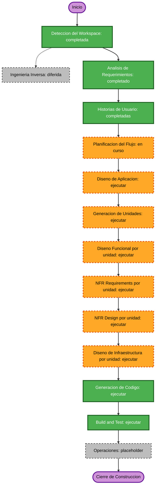

# Plan de Ejecución IA-DLC — Gestión de Listas de Precio

## Resumen ejecutivo
La iniciativa es una transformación brownfield de alto riesgo funcional: incorpora una nueva interfaz web y backend de control de cambios para procesos Softland existentes en Costa Rica, Venezuela y Colombia. La solución habilita gestión global por lista, carga masiva Excel y gestión individual, con segregación Solicitante/Aprobador, simulación obligatoria, ejecución posterior a aprobación, auditoría y recuperación controlada.

No existe código ejecutable ni scripts legacy en el workspace. Por ello, la integración concreta con Softland, los contratos existentes y los objetos de base de datos se validarán durante el diseño; no se asumen esquemas, consultas SQL ni procedimientos adicionales.

## Análisis detallado

### Alcance de transformación brownfield
| Aspecto | Evaluación |
|---|---|
| Tipo de transformación | Arquitectónica y de aplicación: nueva interfaz interna, backend de control de cambios y adaptación a procesos Softland existentes. |
| Cambios principales | Tres flujos de solicitud, simulación/validación, maker-checker, ejecución híbrida, auditoría, control de ámbito, observabilidad y recuperación. |
| Código existente disponible | No. La ingeniería inversa se mantiene diferida hasta recibir scripts del Job, SP maestro y SPs por compañía. |
| Lógica de datos existente | SPs masivos/globales existen o están avanzados; no se diseñan consultas SQL en esta etapa. |
| Dependencias pendientes | SSO/IdP corporativo, mecanismo de integración con portal, contratos backend, plantilla Excel, rangos de factor individuales e idempotencia concreta. |

### Evaluación de impacto
| Área | Impacto | Descripción |
|---|---|---|
| Experiencia de usuario | Alto | Nuevos recorridos para Solicitante, Aprobador y Auditor/Administrador. |
| Arquitectura | Alto | Nuevos componentes frontend, backend, autorización, orquestación de ejecución, auditoría y observabilidad. |
| Datos | Alto | Cambios de precio productivos, evidencia de solicitud y resultados; integración con SPs existentes y actualización individual autorizada. |
| Contratos API | Alto | Se requieren contratos para simulación, carga, solicitud, aprobación, cancelación, ejecución, resultados y auditoría. |
| Seguridad y NFR | Alto | SSO/IdP, control de ámbito server-side, segregación de funciones, secretos, cifrado, logging, alertas, recuperación e idempotencia. |
| Infraestructura y operaciones | Alto | Requiere decisiones de despliegue, red, observabilidad, CI/CD, rollback, backup, recuperación y operación. |

### Relaciones de componentes
| Componente | Tipo de cambio | Prioridad | Dependencias conocidas |
|---|---|---|---|
| PWA / interfaz web interna | Mayor | Crítica | SSO/IdP, API de backend, políticas de seguridad web. |
| Backend de solicitudes y aprobación | Mayor | Crítica | Identidad corporativa, contratos Softland, autorización, bitácora y ejecución. |
| Integración de simulación y ejecución | Mayor | Crítica | SPs autorizados para global/masivo; autorización de actualización individual; resultados correlacionables. |
| Almacenamiento de archivos y evidencia | Mayor | Alta | Plantilla Excel, validación, cifrado, retención y control de acceso. |
| Auditoría y observabilidad | Mayor | Crítica | Identificadores de correlación, logging estructurado, métricas, alertas y retención. |
| Seguridad e infraestructura | Mayor | Crítica | Red corporativa/VPN, SSO/IdP, secretos, red restrictiva, despliegue y DR. |
| Objetos Softland legacy | Pendiente de validación | Crítica | Scripts del Job, SP maestro, SPs por compañía y contratos existentes. |

### Estrategia de coordinación brownfield
- **Enfoque:** Secuencial con validaciones de integración tempranas.
- **Ruta crítica:** definir contratos y autorización; diseñar flujos y estado; validar integración Softland; diseñar infraestructura/NFR; implementar y probar por unidades.
- **Puntos de coordinación:** contratos backend, identidad corporativa, autorización por ámbito, interfaces con SPs, formato de plantilla Excel, auditoría y resultados.
- **Dependencias no disponibles:** no se pueden establecer versiones ni orden de despliegue de componentes Softland hasta disponer de los scripts y contratos.

### Riesgo
| Dimensión | Evaluación | Justificación |
|---|---|---|
| Nivel de riesgo | Alto | Cambios de precio productivos, múltiples roles, segregación, integración externa y recuperación controlada. |
| Complejidad de rollback | Difícil | Los cambios de precio y la evidencia son persistentes; la reversión requiere el procedimiento autorizado y trazabilidad. |
| Complejidad de pruebas | Compleja | Incluye permisos, ámbitos, simulación, archivos, estados, concurrencia, idempotencia, SPs y recuperación. |
| Mitigación principal | Obligatoria | Maker-checker, simulación, validación backend, ejecución única, auditoría, pruebas por propiedades, observabilidad y despliegue controlado. |

## Visualización del flujo

### Alternativa textual
Inicio → Detección del Workspace (completada) → Análisis de Requerimientos (completado) → Historias de Usuario (completadas) → Planificación del Flujo (en curso) → Diseño de Aplicación → Generación de Unidades → Diseño Funcional → NFR Requirements → NFR Design → Diseño de Infraestructura → Generación de Código → Build and Test → Operaciones (placeholder). La ingeniería inversa queda diferida hasta recibir los artefactos Softland necesarios.

## Fases recomendadas

### Incepción
- [x] Detección del Workspace — completada.
- [ ] Ingeniería Inversa — diferida. No existe código ni scripts Softland para analizar; se reactivará cuando estén disponibles.
- [x] Análisis de Requerimientos — completado.
- [x] Historias de Usuario — completadas y aprobadas.
- [x] Planificación del Flujo — en curso; requiere respuestas a `workflow-planning-questions.md` y aprobación de este plan.
- [ ] Diseño de Aplicación — **EJECUTAR**. Se necesitan componentes, límites, dependencias, contratos backend, modelo de autorización y flujos de estado.
- [ ] Generación de Unidades de Trabajo — **EJECUTAR**. La solución tiene múltiples módulos, APIs, persistencia de solicitudes, integración, NFR e infraestructura.

### Construcción
- [ ] Diseño Funcional por unidad — **EJECUTAR**. Se requiere para reglas de factor, simulación, validación Excel, estados, aprobación e idempotencia.
- [ ] NFR Requirements por unidad — **EJECUTAR**. Se requiere para SSO, seguridad, rendimiento, disponibilidad, observabilidad y PBT.
- [ ] NFR Design por unidad — **EJECUTAR**. Se requiere para controles de seguridad, reintentos, fallos seguros, alertas, DR y operación.
- [ ] Diseño de Infraestructura por unidad — **EJECUTAR**. Se requiere para hosting, red, secretos, almacenamiento, auditoría, monitoreo, respaldo y despliegue.
- [ ] Generación de Código por unidad — **EJECUTAR**. Etapa obligatoria; se realizará después de los diseños aprobados.
- [ ] Build and Test — **EJECUTAR**. Etapa obligatoria con pruebas unitarias, integración, autorización, PBT y validaciones de resiliencia.

### Operaciones
- [ ] Operaciones — **PLACEHOLDER**. Se prepararán los insumos operativos durante construcción; la etapa se mantiene reservada por el flujo IA-DLC.

## Orden recomendado de trabajo
1. Cerrar las decisiones de resiliencia, operación y despliegue del archivo de preguntas.
2. Diseñar la aplicación: frontend, backend, autorización, orquestación, contratos e integración corporativa.
3. Descomponer el trabajo en unidades y dependencias.
4. Diseñar y construir cada unidad con sus NFR e infraestructura antes de pasar a la siguiente.
5. Ejecutar Build and Test integrado y preparar evidencias de operación.

## Criterios de éxito y quality gates
- Las 17 historias y sus criterios de aceptación se trazan a componentes, unidades y pruebas.
- Ninguna ejecución productiva sucede sin aprobación válida, control de ámbito y segregación de funciones.
- Global y masivo invocan el SP autorizado; individual actualiza solo desde backend autorizado después de aprobación.
- El flujo mantiene una ejecución automática única, reintentos transitorios limitados y reproceso explícito auditado.
- La solución no expone secretos, credenciales ni detalles internos en pantalla, API o auditoría funcional.
- Se definen y verifican contratos de SSO/IdP, backend y Softland antes de implementación.
- Se adoptan decisiones explícitas de recuperación, cambio, CI/CD, rollback, despliegue, región e incidentes.
- Las pruebas incluyen ejemplos y pruebas basadas en propiedades para factores, cálculos, archivos e idempotencia.

## Cumplimiento de extensiones habilitadas

### Security Baseline
| Estado | Cobertura en el plan |
|---|---|
| Conforme en planificación | Se ejecutarán Diseño de Aplicación, NFR Requirements, NFR Design, Diseño de Infraestructura y Build and Test para concretar cifrado, headers compatibles con la integración corporativa, validación, autorización server-side, IAM, red, logging, alertas, hardening, cadena de suministro y manejo seguro de errores. |

### Resiliency Baseline
| Estado | Cobertura en el plan |
|---|---|
| Conforme con decisiones pendientes | El plan ejecuta NFR e infraestructura y creó preguntas para RTO/RPO, gestión de cambios, CI/CD, rollback, despliegue, topología regional e incidentes. Las respuestas son requeridas antes de aprobar el plan y no se infieren. Pruebas de resiliencia se resolverán en NFR Design. |

### Property-Based Testing
| Estado | Cobertura en el plan |
|---|---|
| Conforme en planificación | Diseño Funcional identificará propiedades; NFR Requirements seleccionará el framework; generación de código incorporará PBT y ejemplos; Build and Test incluirá seeds, shrinking y ejecución en CI. |

## Validación de contenido
- [x] Markdown validado.
- [x] Mermaid usa identificadores alfanuméricos y guiones bajos, sintaxis de flujo válida y alternativa textual.
- [x] No contiene ASCII art, consultas SQL, secretos ni credenciales.
- [x] Las fases recomendadas se derivan del alcance, las 17 historias y las extensiones habilitadas.
