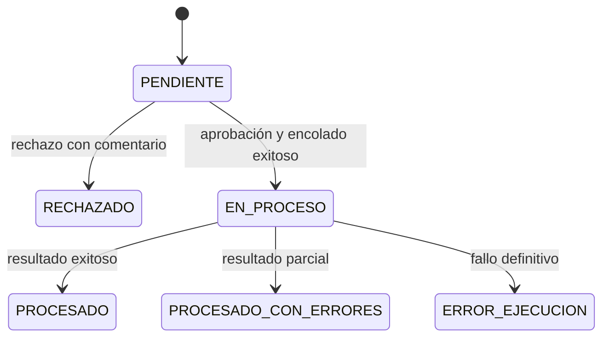
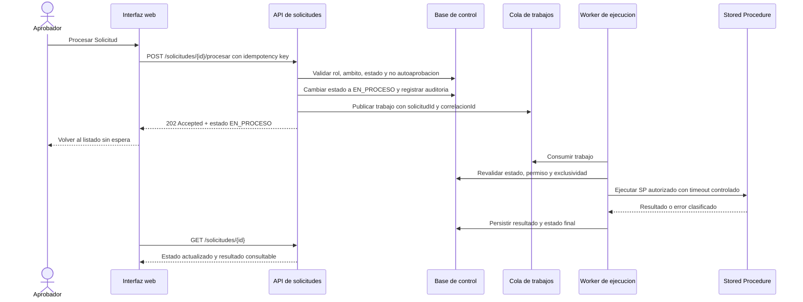

# Procesamiento asíncrono no bloqueante de Stored Procedures

## Objetivo

Permitir que los Stored Procedures (SP) de larga duración procesen solicitudes masivas sin bloquear al Aprobador ni al Solicitante. Después de una aprobación válida, la solicitud cambia inmediatamente a **EN_PROCESO** y el usuario puede navegar, continuar trabajando o cerrar sesión. El resultado final se consulta desde el listado y el detalle de la solicitud.

## Estados funcionales

| Estado | Significado | Acción disponible |
|---|---|---|
| `PENDIENTE` | Espera decisión de un Aprobador autorizado. | Revisar, simular, aprobar o rechazar. |
| `EN_PROCESO` | El trabajo fue aceptado por el backend y está encolado o ejecutándose. | Consultar detalle; no editar, aprobar ni duplicar la ejecución. |
| `PROCESADO` | El SP finalizó correctamente. | Consultar resultado y evidencia. |
| `PROCESADO_CON_ERRORES` | El SP terminó con registros rechazados, pero produjo resultados válidos. | Consultar detalle y exportar errores. |
| `ERROR_EJECUCION` | El SP o su infraestructura falló definitivamente. | Consultar evidencia; un reproceso exige nueva autorización. |
| `RECHAZADO` | La solicitud no fue aprobada. | Consultar motivo y simulación original. |

Transiciones permitidas:



Alternativa textual: `PENDIENTE` pasa a `EN_PROCESO` al encolar el trabajo. Solo el trabajador de fondo puede llevarlo a `PROCESADO`, `PROCESADO_CON_ERRORES` o `ERROR_EJECUCION`. No existe retorno automático a `PENDIENTE`.

## Arquitectura propuesta



Alternativa textual: la interfaz recibe una respuesta rápida `202 Accepted`; el trabajo pesado se ejecuta fuera de la solicitud HTTP. Un worker ejecuta el SP y registra el estado final. El frontend solo consulta el recurso de solicitud.

## Componentes y responsabilidades

| Componente | Responsabilidad |
|---|---|
| Interfaz web | Solicita el procesamiento, muestra el badge `EN_PROCESO`, permite navegación y consulta posterior. No ejecuta el SP ni espera su finalización. |
| API de solicitudes | Valida autenticación, rol, ámbito, segregación y estado; crea el registro de trabajo de forma atómica y responde `202 Accepted`. |
| Persistencia de control | Mantiene solicitud, estado, correlación, llave de idempotencia, intentos, timestamps, resultado y auditoría inmutable. |
| Cola / Background Job | Desacopla la API del SP y entrega el trabajo al worker con política de reintentos solo para errores transitorios. |
| Worker | Consume un único trabajo, toma un bloqueo lógico por solicitud, invoca el SP autorizado, clasifica el resultado y persiste el estado final. |
| Stored Procedure | Ejecuta la lógica masiva autorizada y devuelve un resumen correlacionable de registros procesados, rechazados y fallidos. |
| Servicio de notificación opcional | Puede informar al usuario al finalizar; no reemplaza la consulta del listado. |

## Contratos mínimos

### Iniciar procesamiento

`POST /api/solicitudes/{solicitudId}/procesar`

Respuesta esperada: `202 Accepted`.

```json
{
  "solicitudId": "SOL-10448",
  "estado": "EN_PROCESO",
  "idProceso": "PRC-20260824-0001",
  "correlationId": "c0a8015e-...",
  "mensaje": "La solicitud fue encolada para procesamiento. Puede continuar trabajando."
}
```

Validaciones obligatorias: autenticación, rol Aprobador, ámbito por compañía/lista/categoría, no autoaprobación, estado actual `PENDIENTE`, llave de idempotencia y autorización para el SP asociado.

### Consultar estado

`GET /api/solicitudes/{solicitudId}`

La respuesta debe incluir el estado actual, el identificador del proceso, la fecha de última actualización y, al finalizar, los contadores y detalle permitido del resultado. El control de acceso se valida nuevamente por objeto para evitar acceso indebido a otra solicitud.

## Polling y actualización de UI

1. Tras recibir `202 Accepted`, el frontend actualiza inmediatamente el registro visible a `EN_PROCESO`.
2. Si el listado tiene solicitudes en proceso, consulta el endpoint de estado cada 15 a 30 segundos mientras la pantalla está activa.
3. El polling se detiene cuando el usuario cambia de vista, cierra sesión o todos los trabajos visibles terminan.
4. Al recibir un estado terminal, el frontend actualiza el badge, habilita el detalle de resultado y muestra una notificación funcional.
5. Una solución futura puede complementar el polling con SSE o WebSocket, pero el backend debe conservar la misma API de consulta como fuente de verdad.

## Idempotencia, concurrencia y reintentos

- La aprobación debe incluir una `Idempotency-Key`; peticiones repetidas devuelven el mismo trabajo en vez de disparar nuevamente el SP.
- La transición `PENDIENTE → EN_PROCESO` y la creación del trabajo deben ocurrir dentro de una misma transacción de control.
- El worker debe reclamar el trabajo mediante bloqueo o actualización condicional para impedir dos consumidores sobre la misma solicitud.
- Solo se reintentan fallos transitorios, hasta tres intentos, con espera exponencial y jitter.
- Errores de validación, autorización, parámetros o regla de negocio no se reintentan automáticamente.
- El reproceso de un estado terminal requiere una nueva solicitud o una acción excepcional autorizada y auditada; nunca se reejecuta automáticamente.

## Observabilidad y seguridad

- Usar el mismo `correlationId` en API, cola, worker, logs y resultado del SP.
- Registrar eventos `EJECUCION_ENCOLADA`, `EJECUCION_INICIADA`, `EJECUCION_REINTENTADA`, `EJECUCION_FINALIZADA` y `EJECUCION_FALLIDA` sin secretos, tokens ni datos de conexión.
- La Auditoría debe mostrar en lenguaje amigable el resultado del control de estados que aplica el Stored Procedure sobre la Lista Base al finalizar: **"OK · Ejecutado completo"** cuando todos los registros se aplicaron, **"Completado con errores"** cuando hubo registros exitosos y fallidos, o **"Error de ejecución"** cuando ningún registro se aplicó. Esta traducción es responsabilidad de la capa de presentación; el backend conserva los contadores exactos (`exitosos`, `fallidos`, `totalLote`) como fuente de verdad.
- La versión de la Lista Base que valida el Stored Procedure antes de ejecutar se resuelve y confirma automáticamente en backend; la interfaz no debe exponer el estado interno de esa versión (por ejemplo, no mostrar literalmente "APROBADA"), sino comunicar de forma funcional que la versión fue validada.
- Aplicar timeouts explícitos a API, conexión y ejecución del SP; una llamada no debe esperar indefinidamente.
- Conservar auditoría append-only con usuario aprobador, fecha/hora, transición de estado e identificador de proceso.
- El worker usa un rol de mínimo privilegio que puede ejecutar únicamente los SP autorizados y escribir en los registros propios de control/auditoría.
- La API debe devolver mensajes funcionales; los detalles técnicos se limitan a logs protegidos para operación.

## Ejercicio práctico en el mockup

### Paso 1 — Detalle de solicitud

1. Cambie la identidad a **María Rodríguez — APROBADOR**.
2. Abra `SOL-10448` desde **Bandeja de Aprobación**.
3. Presione **Simular como solicitante** y luego **Procesar Solicitud**.
4. Resultado esperado: el modal se cierra, la solicitud cambia inmediatamente a **En proceso** y se asigna un ID de proceso.

### Paso 2 — Listado general y navegación libre

1. Permanezca o regrese a **Bandeja de Aprobación**.
2. Observe el badge azul/índigo **En proceso** y el botón **Consultar avance**.
3. Navegue a otra pantalla o cambie de identidad: no existe una pantalla de carga que bloquee al usuario.
4. Resultado esperado: la ejecución sigue simulada en segundo plano y el listado continúa disponible.

### Paso 3 — Seguimiento y estado final

1. Presione **Consultar avance** mientras el estado está `EN_PROCESO` para ver el identificador de proceso y el mensaje funcional.
2. Cierre el detalle y espere unos segundos.
3. Consulte de nuevo el listado o el detalle.
4. Resultado esperado: el estado se actualiza a `PROCESADO`, `PROCESADO_CON_ERRORES` o `ERROR_EJECUCION`, con sus contadores, evidencia y exportaciones disponibles.

## Pruebas recomendadas

- Ejemplo: aprobar una solicitud pendiente autorizada produce respuesta `202` y estado visible `EN_PROCESO` sin bloquear la UI.
- Ejemplo: cerrar el detalle o navegar no cancela el trabajo de fondo.
- Ejemplo: un resultado exitoso actualiza `EN_PROCESO → PROCESADO` y deja resultado consultable.
- Propiedad de estado: ninguna secuencia válida permite transiciones desde un estado terminal hacia `EN_PROCESO` sin crear una nueva autorización.
- Propiedad de idempotencia: ejecutar el comando de aprobación varias veces con la misma llave genera un único `idProceso` y una sola invocación efectiva del SP.
- Propiedad de exclusividad: para cualquier número de consumidores concurrentes, una solicitud tiene como máximo un worker ejecutando su SP.
- Propiedad de reintentos: solo los fallos clasificados como transitorios incrementan el contador de intentos; los fallos funcionales llegan directamente a estado terminal.

## Cumplimiento de extensiones habilitadas

| Regla | Estado | Aplicación en este diseño |
|---|---|---|
| SECURITY-03, SECURITY-14 | Conforme en diseño | Correlación, logs estructurados sin secretos, auditoría append-only y métricas/alertas de trabajos fallidos. |
| SECURITY-05, SECURITY-08, SECURITY-11, SECURITY-15 | Conforme en diseño | Validación de entrada, autorización por objeto/rol/ámbito, prevención de abuso e interrupción segura ante errores. |
| SECURITY-01, SECURITY-02, SECURITY-04, SECURITY-06, SECURITY-07, SECURITY-09, SECURITY-10, SECURITY-12, SECURITY-13 | Pendiente de infraestructura/código | Deben concretarse en diseño de infraestructura, implementación y CI/CD; no se declaran recursos productivos en este mockup. |
| RESILIENCY-01, RESILIENCY-05, RESILIENCY-06, RESILIENCY-07, RESILIENCY-09, RESILIENCY-10 | Conforme en diseño | Trabajo crítico identificado, correlación, monitoreo, timeouts, cola y límites de reintentos propuestos. |
| RESILIENCY-02, RESILIENCY-03, RESILIENCY-04, RESILIENCY-08, RESILIENCY-11 a RESILIENCY-15 | Pendiente de decisiones organizacionales | RTO/RPO, DR, CI/CD, rollback, topología regional e incidentes requieren aprobación de negocio/operaciones. |
| PBT-01, PBT-03, PBT-04, PBT-06 a PBT-10 | Conforme en planificación | Se identificaron propiedades de transición, idempotencia, exclusividad y reintentos; la selección de framework e implementación corresponde a fases de construcción. |
| PBT-02, PBT-05 | N/A | Este flujo no define transformaciones inversas ni un oráculo funcional independiente para el SP. |
